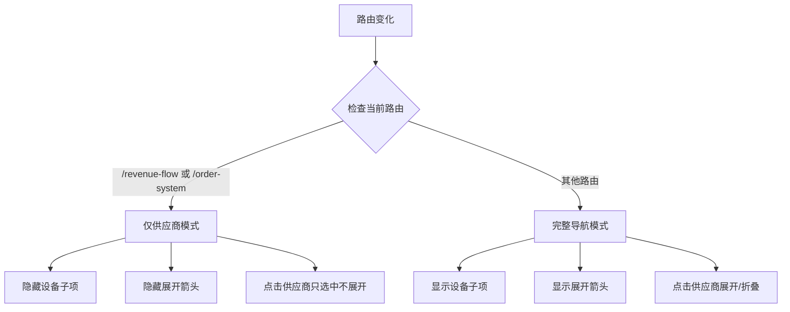
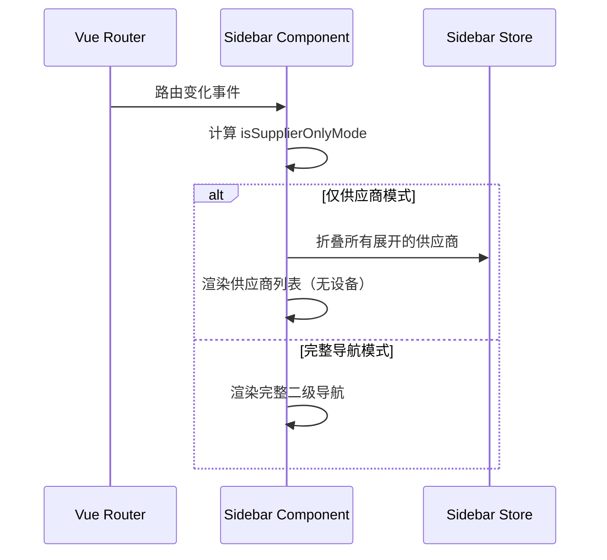

# Design Document: Sidebar Supplier-Only Mode

## Overview

本设计实现管理员视图下侧边栏的动态显示模式切换功能。根据当前路由，侧边栏在"仅供应商模式"和"完整导航模式"之间自动切换。在营收流水和订单系统页面，侧边栏只显示供应商列表；在其他页面则显示完整的供应商+设备二级导航。

## Architecture

### 模式切换流程



### 组件交互



## Components and Interfaces

### 1. Sidebar Component 修改

**新增计算属性：**

```typescript
// 定义仅供应商模式的路由列表
const supplierOnlyRoutes = ['/revenue-flow', '/order-system'];

// 计算当前是否为仅供应商模式
const isSupplierOnlyMode = computed(() => {
    return isAdmin.value && supplierOnlyRoutes.includes(route.path);
});
```

**修改模板逻辑：**

- 在供应商项中，根据 `isSupplierOnlyMode` 条件渲染展开箭头
- 在供应商项中，根据 `isSupplierOnlyMode` 条件渲染设备子列表
- 修改供应商点击处理函数，在仅供应商模式下不触发展开/折叠

### 2. Sidebar Store 修改

**新增 Action：**

```typescript
// 折叠所有展开的供应商
collapseAllSuppliers() {
    this.expandedSuppliers = [];
    sessionStorage.setItem('sidebar_expanded', JSON.stringify([]));
}
```

### 3. 接口定义

```typescript
// 侧边栏显示模式
type SidebarDisplayMode = 'supplier-only' | 'full-navigation';

// 供应商点击事件参数
interface SupplierClickEvent {
    supplierId: number;
    supplierName: string;
    mode: SidebarDisplayMode;
}
```

## Data Models

### 路由配置

| 路由路径 | 显示模式 | 说明 |
|---------|---------|------|
| /revenue-flow | supplier-only | 营收流水页面 |
| /order-system | supplier-only | 订单系统页面 |
| /device-manage | full-navigation | 设备管理页面 |
| /dashboard | full-navigation | 系统首页 |
| 其他 | full-navigation | 默认完整导航 |

### 状态管理

```typescript
// Sidebar Store State
interface SidebarState {
    // ... 现有状态
    expandedSuppliers: number[];  // 展开的供应商ID列表
}
```

## Correctness Properties

*A property is a characteristic or behavior that should hold true across all valid executions of a system-essentially, a formal statement about what the system should do. Properties serve as the bridge between human-readable specifications and machine-verifiable correctness guarantees.*

### Property 1: Supplier-only mode activation
*For any* route path that is in the supplier-only routes list (/revenue-flow, /order-system), when an administrator is logged in, the isSupplierOnlyMode computed property should return true.
**Validates: Requirements 1.1, 1.2**

### Property 2: Full navigation mode for other routes
*For any* route path that is NOT in the supplier-only routes list, when an administrator is logged in, the isSupplierOnlyMode computed property should return false.
**Validates: Requirements 1.3**

### Property 3: Supplier click in supplier-only mode
*For any* supplier click event in supplier-only mode, the active supplier should be updated and the expanded suppliers list should remain unchanged (no expansion).
**Validates: Requirements 2.1, 2.2, 2.3**

### Property 4: Mode transition collapses suppliers
*For any* navigation from a full-navigation route to a supplier-only route, all previously expanded suppliers should be collapsed.
**Validates: Requirements 3.2**

### Property 5: Active supplier preservation
*For any* mode transition, if a supplier was selected before the transition, that supplier should remain selected after the transition.
**Validates: Requirements 3.3**

## Error Handling

| 场景 | 处理方式 |
|-----|---------|
| 路由对象未初始化 | 默认使用完整导航模式 |
| 供应商列表为空 | 显示加载状态或空状态提示 |
| 模式切换时状态异常 | 重置为默认状态 |

## Testing Strategy

### Unit Tests

1. 测试 `isSupplierOnlyMode` 计算属性在不同路由下的返回值
2. 测试供应商点击处理函数在不同模式下的行为
3. 测试 `collapseAllSuppliers` action 的正确性

### Property-Based Tests

使用 fast-check 库进行属性测试：

1. **Property 1 & 2**: 生成随机路由路径，验证模式判断逻辑
2. **Property 3**: 生成随机供应商点击事件，验证状态更新
3. **Property 4**: 生成随机展开状态，验证模式切换时的折叠行为
4. **Property 5**: 生成随机选中状态，验证模式切换时的状态保持

### Integration Tests

1. 测试从设备管理页面导航到营收流水页面时的模式切换
2. 测试从订单系统页面导航到设备管理页面时的模式切换
3. 测试在仅供应商模式下选中供应商后切换到完整导航模式
